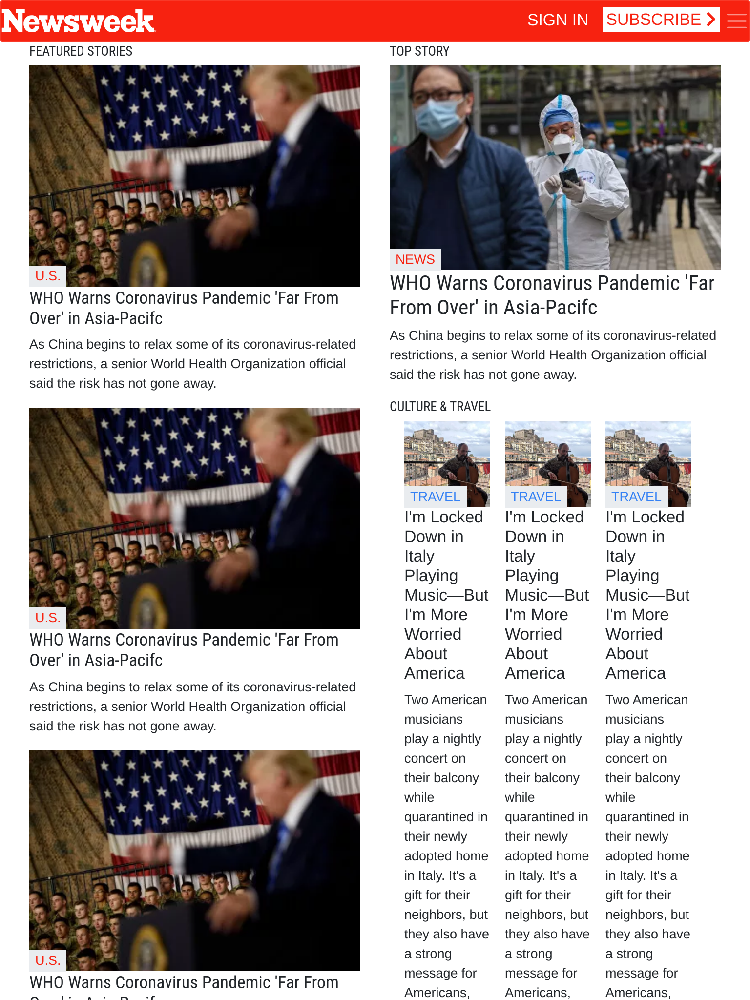
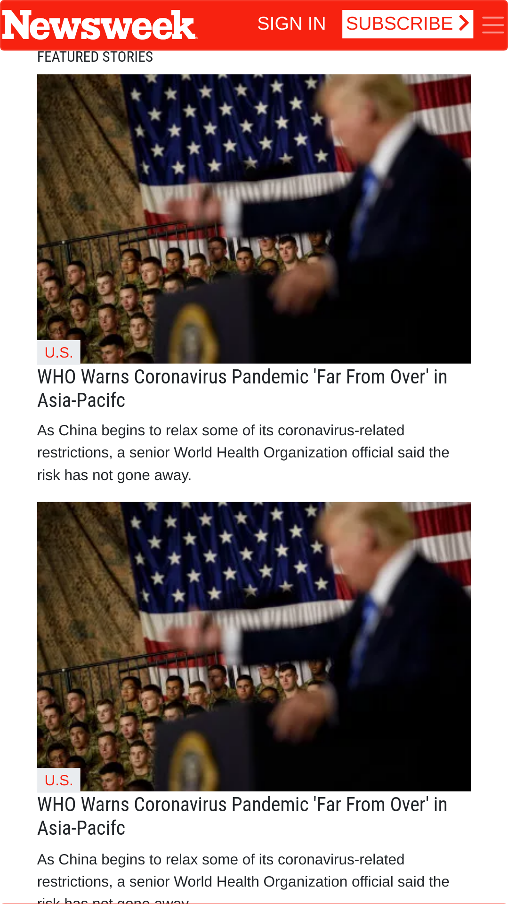

# Bootstrap_Newsweek-clone
>Example of Bootstrap use on an Newsween look alike page

- Responsive page using almost exclusively Bootstrap 4 utilities
- Minimal CSS configuration. 
- Customized Bootstrap css configuration file to match colors and fontsizes

The objective of this excercise was to demonstrate how far we could go using almost exclusively the bootstrap provided features.

## Built With

- CSS/HTML
- Bootstrap 4.4.1
- Themestr.app theme customizer for Bootstrap 4

## Live Demo

[Live Demo Link](https://raw.githack.com/gdumani/Bootstrap_Newsweek-clone/feature-branch/index.html)

### Prerequisites
Modern browser
- It was tested on Chrome 80 and Firefox 73

## Authors

👤 **Author**
Giancarlo Dumani

- Github: [@githubhandle](https://github.com/gdumani)
- Twitter: [@twitterhandle](https://twitter.com/gdumani1)
- Linkedin: [linkedin](https://www.linkedin.com/in/giancarlo-dumani-a7364a1a1/)

## 🤝 Contributing

Contributions, issues and feature requests are welcome!

Feel free to check the [issues page](issues/).

## Show your support

Give a ⭐️ if you like this project!

## Acknowledgments

- This project was part of Microverse's curriculum in CSS/HTML learning program.
- Thanks to the Boostrap development team a Twitter for making this tools openly available.
- Special thanks to the developer of Themes.guide for the customization tool.

## 📝 License

This project is [MIT](lic.url) licensed.